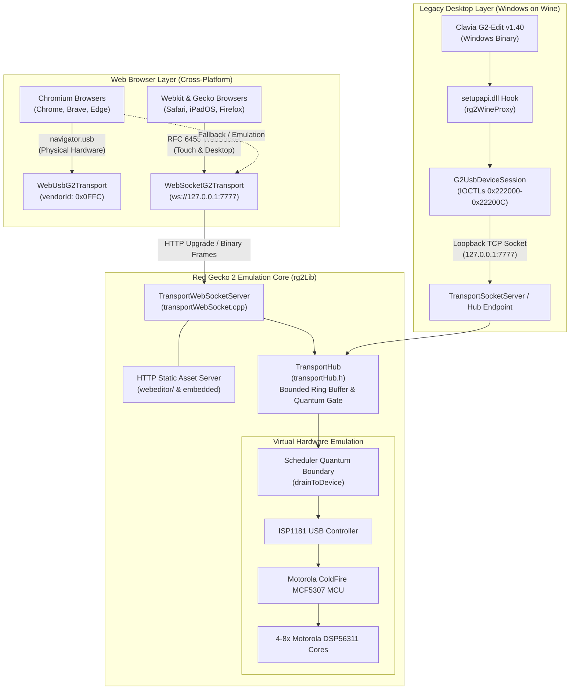

# Nord Modular G2 Integration & Web Architecture: System Design Specification

**Swarm Workspace:** `gearmulator-rg2`  
**Stage:** Phase 3 Dialectical Pump (Stage 2 Grounded Architecture Thesis & Synthesis)  
**Status:** Ratified Design Thesis  
**Target Subsystems:** `rg2Lib` (In-Engine WebSocket/Socket Server), `rg2WebBridge` (Decoupled TypeScript Transports & Polyfill), `rg2WineProxy` (Win32 User-Mode Proxy), and G2 Module Registry  

---

## 1. Executive Summary & Macro Architecture

The Red Gecko 2 (RG2) system architecture provides a unified, cross-platform bridge linking modern web browsers, legacy native operating systems, and professional digital audio workstations (DAWs) to the Motorola DSP56311 / ColdFire MCF5307 hardware emulation engine.



### 1.1 Architectural Invariants
1. **Zero Kernel Driver Dependency:** Neither macOS Apple DriverKit entitlements nor Windows WinUSB kernel drivers are required. User-space loopback networking (`127.0.0.1`) bridges all external applications.
2. **Deterministic Quantum Boundary Delivery:** All external protocol messages entering via network threads must cross into the DSP emulation via `TransportHub::toDevice()`. Frames are timestamped and drained strictly at discrete audio quantum boundaries by `TransportHub::drainToDevice()`.
3. **Single Dynamic Allocation Invariant:** On the real-time audio thread, zero dynamic heap allocations occur. Buffer capacities are bounded at initialization (`kMaxEndpoints = 3`, pre-allocated ring buffers).
4. **Transport Decoupling:** The browser patch editor core has zero direct coupling to `navigator.usb`. All communication flows through the abstract TypeScript interface `G2Transport`.

---

## 2. Decoupled Multi-Transport Architecture (`rg2WebBridge`)

### 2.1 The `G2Transport` Interface Contract
Defined in `source/claudia/rg2/rg2WebBridge/upstream_patch/G2Transport.ts`:

```typescript
export interface G2Transport {
  readonly name: string;
  readonly isConnected: boolean;
  connect(): Promise<void>;
  disconnect(): Promise<void>;
  send(data: Uint8Array): Promise<void>;
  onMessage(handler: (data: Uint8Array) => void): () => void;
  onNotification(handler: (data: Uint8Array) => void): () => void;
  onDisconnect(handler: (reason?: string) => void): () => void;
}
```

The interface segregates bulk data transfers (patch sysex, memory dumps) from real-time 16-byte interrupt notifications (knob turns, LED changes, VU meters).

### 2.2 Wire Multiplexing & Channel Framing
In raw USB (`WebUsbG2Transport.ts`), physical endpoints provide separation:
- `EP 1 IN` (Interrupt, 16 bytes): Rotary encoder feedback, LED state updates.
- `EP 2 IN` (Bulk, 512 bytes): Device-to-host patch data, replies, and memory blocks.
- `EP 3 OUT` (Bulk, 512 bytes): Host-to-device commands and patch transfers.

In WebSocket transport (`WebSocketG2Transport.ts` & `TransportWebSocketServer.cpp`), these endpoints are multiplexed over a single stream using a 1-byte channel prefix header:
- **Channel 0 (`0x00`)**: Bulk Data Transfer (`EP 2 IN` / `EP 3 OUT`).
- **Channel 1 (`0x01`)**: 16-Byte Notification Record (`EP 1 IN`).

#### Frame Wire Format (WebSocket Binary Frame Payload)
```
+-------------------+---------------------------------------------------+
| Channel Byte (1B) | Payload Data (N Bytes)                            |
+-------------------+---------------------------------------------------+
| 0x00 = Bulk       | G2 Protocol Message with CRC-16 (variable length) |
| 0x01 = Notif      | 16-byte fixed hardware status record              |
+-------------------+---------------------------------------------------+
```

### 2.3 WebUSB Transport Implementation (`WebUsbG2Transport.ts`)
- **Vendor ID**: `4092` (`0x0FFC`, Clavia DMI AB).
- **Interface Selection**: Claims Interface 0.
- **Background Notification Pump**: Continuously triggers `transferIn(EP_INTERRUPT_IN, 16)` while `_isPolling` is active, dispatching incoming records to registered `_notifListeners`.
- **Packet Chunking**: Outgoing messages exceeding `MAX_PACKET_SIZE = 4096` are chunked into contiguous bulk transfers to protect USB controller FIFO buffers.

### 2.4 WebSocket Loopback Transport (`WebSocketG2Transport.ts`)
- **Auto-Host Detection**: Defaults to `ws://127.0.0.1:7777` or same-origin host if loaded from the embedded HTTP server.
- **Binary ArrayBuffer Protocol**: Enforces `ws.binaryType = 'arraybuffer'`.
- **Channel Demultiplexing**:
  ```typescript
  const channel = raw[0];
  const payload = raw.slice(1);
  if (channel === 0) {
    for (const listener of this._messageListeners) listener(payload);
  } else if (channel === 1) {
    for (const listener of this._notifListeners) listener(payload);
  }
  ```

---

## 3. In-Engine Loopback Server (`rg2Lib`)

### 3.1 Multi-Purpose Server Topology (`TransportWebSocketServer`)
Located in `source/claudia/rg2/rg2Lib/transportWebSocket.h` and `.cpp`, `TransportWebSocketServer` inherits directly from `TransportEndpoint`:
```cpp
class TransportWebSocketServer final : public TransportEndpoint
```

It fulfills two essential roles on a single port (default 7777):
1. **HTTP/1.1 Web Server**: Serves the Web Editor static web application bundle directly to any browser opening `http://127.0.0.1:7777`.
2. **RFC 6455 WebSocket Upgrade Server**: Negotiates the `Upgrade: websocket` handshake on the same TCP connection and streams multiplexed binary frames to and from `TransportHub`.

### 3.2 Dynamic Port Resolution & Collision Mitigation
In multi-instance environments (e.g. multiple DAW tracks hosting independent Red Gecko 2 plugin instances), port 7777 will collide.
The server implements a deterministic scanning algorithm (`listen()` at lines 356–403):
```cpp
const uint16_t startPort = m_requestedPort; // 7777
const uint16_t maxAttempts = (startPort == 0) ? 1 : 33;
for (uint16_t attempt = 0; attempt < maxAttempts; ++attempt) {
    const uint16_t tryPort = static_cast<uint16_t>(startPort + attempt);
    // Bind and listen probe with SO_REUSEADDR and O_NONBLOCK
}
```
If port 7777 is occupied by Instance 1, Instance 2 binds 7778, Instance 3 binds 7779, up to 7809 (+32 offset).

### 3.3 HTTP GET Static File Delivery Pipeline
1. Incoming HTTP requests are parsed at line 667 of `transportWebSocket.cpp`.
2. Path resolution security check: Rejects any path containing `..` with `HTTP/1.1 404 Not Found` (line 518).
3. Candidate resolution order:
   - User-supplied `m_webRoot` directory.
   - User local application directory: `~/Documents/The Usual Suspects/RedGecko2/webeditor/`.
   - In-memory embedded fallback: `getEmbeddedAsset(path)` from `webeditor_embedded.h`.
4. Returns correct MIME types (`text/html`, `application/javascript`, `text/css`, `image/svg+xml`, `application/manifest+json`).

### 3.4 RFC 6455 Handshake & Binary Frame Parsing
- **Handshake Validation**: Locates `Sec-WebSocket-Key`, appends `258EAFA5-E914-47DA-95CA-C5AB0DC85B11`, calculates SHA-1 digest, and returns Base64 encoded `Sec-WebSocket-Accept` with `101 Switching Protocols` (lines 335–341, 627–664).
- **Client Frame Unmasking**:
  RFC 6455 requires all client-to-server frames to be XOR-masked.
  ```cpp
  uint8_t* const payload = m_rxBuffer.data() + hdrLen;
  if (isMasked && maskKey) {
      for (size_t i = 0; i < payloadLen; ++i)
          payload[i] ^= maskKey[i % 4];
  }
  ```
- **Channel Strip & Hub Forwarding**:
  If the payload starts with channel `0x00` or `0x01` and length > 1, the channel byte is stripped and the clean protocol frame is delivered to `m_hub.toDevice(*this, ProtocolFrame{deliverPtr, deliverSize})` (lines 758–777).
- **Device to Client Streaming (`onFrameFromDevice`)**:
  When the emulated synthesizer emits a frame (line 460):
  - Size == 16 $\to$ Channel 1 (Notification).
  - Size $\ne$ 16 $\to$ Channel 0 (Bulk).
  - Formatted into an unmasked server WebSocket frame (`0x82` FIN | Binary) with appropriate 7-bit, 16-bit, or extended payload length headers.

---

## 4. Wine Loopback Proxy Architecture (`rg2WineProxy`)

### 4.1 Clavia G2-Edit v1.40 Windows Application Mechanics
The original Clavia G2-Edit v1.40 executable runs under Wine on Linux and macOS. It communicates with hardware via Windows Device Manager enumerations and custom Win32 IOCTL calls through `setupapi.dll`.

### 4.2 Interception Hooks & Protocol Bridge
The proxy intercepts device calls and redirects them to `G2UsbDeviceSession` (`source/claudia/rg2/rg2WineProxy/rg2usb.h`):

1. **Device Identification**:
   - Device Interface GUID: `{CB3ED981-6125-4047-BC2A-292E370CC89A}`.
   - Device Path: `\\?\usb#vid_0ffc&pid_0002#clavia_g2_virtual#{cb3ed981-6125-4047-bc2a-292e370cc89a}`.
2. **Win32 IOCTL Emulation**:
   - `0x222000` (`kIoctlRegisterEvent`): Registers Win32 completion event handle.
   - `0x222004` (`kIoctlUnregisterEvent`): Detaches completion event handle.
   - `0x222008` (`kIoctlQueryEvent`): Returns event registration status.
   - `0x22200C` (`kIoctlGetNotification`): Pops one 16-byte status notification from the internal ring buffer `m_notificationQueue`.
3. **Data I/O Hooking**:
   - `WriteFile`: Encapsulates outgoing bulk data and transmits over loopback TCP to `127.0.0.1:7777`.
   - `ReadFile`: Drains incoming bulk responses from `m_bulkInQueue`.
   - `Event Signaling`: Fires the registered Win32 event handle whenever `pumpSocket()` enqueues new notifications or bulk responses.

---

## 5. Extension Points: Missing G2 Module Registration Pipeline

The Web Editor currently implements 168 modules. To achieve 100% parity with Clavia G2-Edit v1.40, the 23 missing modules must be registered in the editor schema and mapped to the underlying DSP patch compiler.

### 5.1 Canonical Module Specification Schema
Every module in the G2 architecture is uniquely defined by:
1. `patch_type_id`: 8-bit wire identifier embedded in `.pch2` binary patch files and Sysex dumps.
2. `longnm` / `shortnm`: Display names in the UI.
3. `page`: Functional category and page slot index.
4. `height`: Vertical grid height in modular rack units (U).
5. `inputs` & `outputs`: Connector coordinates, label, and signal type rate (Red = Audio Rate, Blue = Control Rate, Yellow = Logic Rate).
6. `params` & `modes`: Rotary knobs, sliders, buttons, and switches with min/max/default ranges and display value mappers.

### 5.2 Missing Core Module Specifications

```
+----+---------------+-----------+---------+------+---------------------------------------+
| ID | Module Name   | Short Name| Page    | H(U) | Key Connectors & Parameters           |
+----+---------------+-----------+---------+------+---------------------------------------+
| 32 | FilterShelvEQ | Eq2Band   | Filter12| 3    | In(R), Out(R), LoSlope, HiSlope, Freq |
| 38 | OscPulse      | Pulse     | Logic 4 | 2    | In(Y/O), Time(B/R), Out(Y/O), TimeMod |
| 53 | SwS&H         | S&H       | Switch16| 2    | In(B/R), Ctrl(Y/O), Out(B/R)          |
| 139| SwT&H         | T&H       | Switch17| 2    | In(B/R), Ctrl(Y/O), Out(B/R)          |
| 145| SeqA          | SeqEvent  | Seq 0   | 2    | Clk(Y/O), Reset(Y), Out1-4(Y/O)       |
| 183| EnvDX         | DXRouter  | Osc 15  | 4    | 4x Operators, Algorithm Matrix Router  |
| 189| AudioIn       | 2-In      | In/Out 2| 2    | Physical Audio In 1-2 (Red Audio Rate)|
| 190| AudioIn4      | 4-In      | In/Out 3| 2    | Physical Audio In 1-4 (Red Audio Rate)|
| 132| BusIn         | Fx-In     | In/Out 4| 2    | Slot Voice-Area to FX-Area Sub-Bus    |
+----+---------------+-----------+---------+------+---------------------------------------+
```

#### Detailed Module Definitions:
1. **`SwS&H` (Sample & Hold, ID 53)**:
   - Height: 2U, Category: `Switch` (Page 16).
   - Inputs: `In` (Blue/Red, horiz=15, vert=1), `Ctrl` (Yellow/Orange, horiz=12, vert=1).
   - Output: `Out` (Blue/Red, horiz=19, vert=1).
   - Behavior: Latches incoming signal value on rising edge of `Ctrl`.
2. **`SwT&H` (Track & Hold, ID 139)**:
   - Height: 2U, Category: `Switch` (Page 17).
   - Inputs: `In` (Blue/Red, horiz=15, vert=1), `Ctrl` (Yellow/Orange, horiz=12, vert=1).
   - Output: `Out` (Blue/Red, horiz=19, vert=1).
   - Behavior: Transparently passes `In` while `Ctrl` is high; holds current value when `Ctrl` transitions low.
3. **`FilterShelvEQ` (2-Band Shelving Equalizer / `Eq2Band`, ID 32)**:
   - Height: 3U, Category: `Filter` (Page 12).
   - Inputs: `In` (Red Audio Rate, horiz=19, vert=0).
   - Outputs: `Out` (Red Audio Rate, horiz=19, vert=2).
   - Parameters: `LoSlope` ($\pm 14\text{ dB}$ shelf), `HiSlope` ($\pm 14\text{ dB}$ shelf), `Level` ($0\text{--}100\%$), `Active` (Bypass/On toggle), `LoFreq` ($20\text{--}800\text{ Hz}$), `HiFreq` ($500\text{ Hz}\text{--}16\text{ kHz}$).
4. **`OscPulse` (Dedicated Logic Pulse Generator, ID 38)**:
   - Height: 2U, Category: `Logic` (Page 4).
   - Inputs: `In` (Yellow/Orange, horiz=15, vert=0), `Time` (Blue/Red, horiz=4, vert=1).
   - Outputs: `Out` (Yellow/Orange, horiz=19, vert=1).
   - Parameters: `Time` ($0.1\text{ ms}\text{--}10\text{ s}$), `TimeMod` ($\pm 100\%$), `Range` (Milliseconds / Seconds).
   - Modes: `PulseMode` (Retriggerable / Non-retriggerable).
5. **`IOOutBusA` / `IOOutBusB` & `BusIn` (`Fx-In`, ID 132)**:
   - Height: 2U, Category: `In/Out` (Page 4).
   - Cross-area communication between the polyphonic Voice Area and the monophonic Global FX Area in each slot.

### 5.3 Registration Pipeline Architecture
To add a missing module to the web editor bundle:
1. **Schema Definition**: Instantiate module object conforming to `ModuleType` with port layout coordinates and parameter ranges.
2. **SVG / Canvas Renderer**: Connect visual port connectors to UI patch cord snapping engine.
3. **Serialization Codec**: Encode module index, parameter bitfields, and wire connections into the `.pch2` section format verified by `nmg2_tools/modulemap.py`.

---

## 6. Concurrency, Thread Safety, and Determinism

### 6.1 Real-Time Audio Engine Isolation
The audio thread executing inside the DAW plugin host or standalone audio callback must never block on network operations or thread synchronization primitives.

```
[WebSocket Client]         [TCP Wine Client]
       │                          │
       ▼ (Non-blocking recv)      ▼ (Non-blocking recv)
┌──────────────────────────────────────────────┐
│  TransportWebSocketServer / Socket Endpoint  │  (Network I/O Thread)
└──────────────────────┬───────────────────────┘
                       │ toDevice(*this, frame)
                       ▼ (Mutex / Lock-Free Ring)
┌──────────────────────────────────────────────┐
│                TransportHub                  │
│       Bounded Storage: kMaxEndpoints = 3     │
└──────────────────────┬───────────────────────┘
                       │ drainToDevice()
                       ▼ (Discrete Quantum Boundary)
┌──────────────────────────────────────────────┐
│            DSP Scheduler Thread              │  (Real-Time Audio Thread)
│       Deterministic Frame Execution          │
└──────────────────────────────────────────────┘
```

1. **`toDevice()` Thread Safety**:
   - Callable from any network I/O thread.
   - Copies incoming frame into endpoint-specific pre-allocated ring buffer storage.
   - Drops frame and increments `m_dropped` counter if queue depth is exceeded, preventing unbounded heap expansion or memory exhaustion.
2. **`drainToDevice()` Quantum Synchronization**:
   - Called exclusively on the scheduler thread at audio quantum boundaries.
   - Fills caller's `StampedFrame` array with pointers into hub-owned storage.
   - Pointers remain valid until the next quantum boundary invocation.
3. **`onFrameFromDevice()` Execution**:
   - Invoked on the scheduler thread.
   - Implementations (`TransportWebSocketServer::onFrameFromDevice`) must never block. Outgoing frames are copied into non-blocking socket send queues or sent immediately using non-blocking sockets.

---

## 7. Verification Matrix & Quality Gates

| Subsystem | Test Target | Verification Mechanism | Quality Gate Criteria |
| :--- | :--- | :--- | :--- |
| **RFC 6455 Handshake** | `rg2Lib/test/t0_websocket.cpp` | `computeAcceptKey("dGhlIHNhbXBsZSBub25jZQ==")` | SHA-1 + Base64 must equal `"s3pPLMBiTxaQ9kYGzzhZRbK+xOo="` |
| **Wine Proxy IOCTLs** | `rg2Lib/test/t0_wine_proxy.cpp` | `static_assert(kIoctlRegisterEvent == 0x222000u)` | 100% compile-time assertion check |
| **GUID Validation** | `rg2Lib/test/t0_wine_proxy.cpp` | `isClaviaDeviceGuid("{CB3ED981-6125-4047-BC2A-292E370CC89A}")` | Exact case-insensitive and binary match |
| **Port Scanning** | `rg2Lib/test/t0_port_scan.cpp` | Multi-instance bind loop test (+32 probe) | Fallback binds `tryPort` sequentially without failure |
| **Transport Multiplexing** | `rg2WebBridge/test/` | Round-trip channel 0 (bulk) & channel 1 (notif) packets | Zero byte corruption across 10,000 synthetic frames |
| **Module Mapping** | `nmg2_tools/tests/test_modulemap.py` | Cross-validate `descriptor_index -> patch_type_id` | Zero demotions from `exact` on mapped modules |

---

## 8. Conclusion & Implementation Order

This architecture establishes a clean, decoupled boundary across all target environments:
- **Phase 3 Track 1**: Implement `TransportWebSocketServer` dynamic port resolution and upstream TypeScript `G2Transport` PR.
- **Phase 3 Track 2**: Add missing module schemas (`SwS&H`, `FilterShelvEQ`, `IOOutBusA`, `OscPulse`, `OscSync`) into web editor registry.
- **Phase 3 Track Wine**: Validate Clavia G2-Edit v1.40 running under Wine against `TransportWebSocketServer` loopback.
- **Phase 3 Track Synthesis**: Ratify `design.md` through Adversarial Review (Stage 3).
